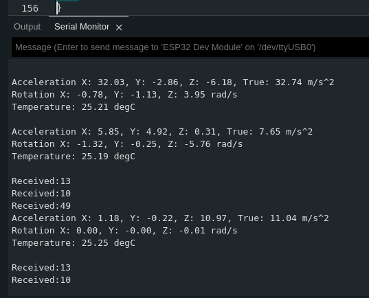

# SmartDisc

School project for Haaga Helia.

In this project we are creating a smart device that will be attached to a disc golf disc. The device will have a buzzer to help find the disc if it is thrown in to the bush. It will also have sensors for acceleration and gyro, so we can get the top speed and rotation speed of the disc. Gyro sensor will also be used to get the angle of the disk.

The idea is that the player can use these information to help better their play.

## Project Plan

- Assignment for Haaga-Helia's ICT-Infrastructure project.
- Purpose of our project is to build a smart-frisbee using ESP-32 dev board, it's chips and open data.

## Development Tools

- Project developed using [ArduinoIDE](https://www.arduino.cc/en/software)
- Dev board used: ESP32-WROOM  
  
- Chips used: MPU-6050 (3 access gyro & accelometer)  
  
  <sub>**Further development aims to add features and integrate the chips to the golf disc**</sub>

# SmartDisc

- In this project we are creating a smart device that will be attached to a disc golf disc.
- The device will have a buzzer to help find the disc if it is thrown in to the bush.
- It will also have sensors for acceleration and gyro, so we can get the top speed and rotation speed of the disc. Gyro sensor will also be used to get the angle of the disk.
- The idea is that the player can use these information to help better their play.

## User Stories

- As a aspiring frisbee golf player I want to get data from from my throws to improve my game.
- As a player I want to easily find my lost disc using the inbuilt speaker that pinpoint its location.

## Target Audience

- The target audience for SmartDisc are frisbee golf professionals, enthusiasts and recreational playet that want to imnprove their game and easily find their lost discs

## ArduinoIDE

### Linux

When we first tried uploading code to the ESP32 we got an error code:

```
A fatal error occurred: Could not open /dev/ttyUSB0, the port doesn't exist
```

this was fixed with giving right permissions to the port

```
sudo chmod a+rw /dev/ttyUSB0
```

# Tests

Verifying that the chip works by uploading a basic code block to it using Arduino IDE with success.

```
void setup() {
  // Initialize serial communication
  Serial.begin(115200);
}

void loop() {
  // Send "Hello, World!" over serial
  Serial.println("Hello, World!");
  delay(1000); // Wait for a second
}
```


We also tested that the wifi works on the ESP32.  


## Acceleration and Gyro (MPU6050)

First we connected the Acceleration/Gyro sensor to the ESP32.


Installed nessessaru libraries (Adafruit MPU6050) for the MPU6050
Then we tested that the sensor works with example code.

The code was found in `file` --> `Examples` --> `Adafruit MPU6050` --> `basic_readings`

<details>
<summary>Code</summary>
<br>  
<pre>
  // Basic demo for accelerometer readings from Adafruit MPU6050

#include <Adafruit_MPU6050.h>
#include <Adafruit_Sensor.h>
#include <Wire.h>

Adafruit_MPU6050 mpu;

void setup(void) {
Serial.begin(115200);
while (!Serial)
delay(10); // will pause Zero, Leonardo, etc until serial console opens

Serial.println("Adafruit MPU6050 test!");
^
// Try to initialize!
if (!mpu.begin()) {
Serial.println("Failed to find MPU6050 chip");
while (1) {
delay(10);
}
}
Serial.println("MPU6050 Found!");

mpu.setAccelerometerRange(MPU6050_RANGE_8_G);
Serial.print("Accelerometer range set to: ");
switch (mpu.getAccelerometerRange()) {
case MPU6050_RANGE_2_G:
Serial.println("+-2G");
break;
case MPU6050_RANGE_4_G:
Serial.println("+-4G");
break;
case MPU6050_RANGE_8_G:
Serial.println("+-8G");
break;
case MPU6050_RANGE_16_G:
Serial.println("+-16G");
break;
}
mpu.setGyroRange(MPU6050_RANGE_500_DEG);
Serial.print("Gyro range set to: ");
switch (mpu.getGyroRange()) {
case MPU6050_RANGE_250_DEG:
Serial.println("+- 250 deg/s");
break;
case MPU6050_RANGE_500_DEG:
Serial.println("+- 500 deg/s");
break;
case MPU6050_RANGE_1000_DEG:
Serial.println("+- 1000 deg/s");
break;
case MPU6050_RANGE_2000_DEG:
Serial.println("+- 2000 deg/s");
break;
}

mpu.setFilterBandwidth(MPU6050_BAND_21_HZ);
Serial.print("Filter bandwidth set to: ");
switch (mpu.getFilterBandwidth()) {
case MPU6050_BAND_260_HZ:
Serial.println("260 Hz");
break;
case MPU6050_BAND_184_HZ:
Serial.println("184 Hz");
break;
case MPU6050_BAND_94_HZ:
Serial.println("94 Hz");
break;
case MPU6050_BAND_44_HZ:
Serial.println("44 Hz");
break;
case MPU6050_BAND_21_HZ:
Serial.println("21 Hz");
break;
case MPU6050_BAND_10_HZ:
Serial.println("10 Hz");
break;
case MPU6050_BAND_5_HZ:
Serial.println("5 Hz");
break;
}

Serial.println("");
delay(100);
}

void loop() {

/_ Get new sensor events with the readings _/
sensors_event_t a, g, temp;
mpu.getEvent(&a, &g, &temp);

/_ Print out the values _/
Serial.print("Acceleration X: ");
Serial.print(a.acceleration.x);
Serial.print(", Y: ");
Serial.print(a.acceleration.y);
Serial.print(", Z: ");
Serial.print(a.acceleration.z);
Serial.println(" m/s^2");

Serial.print("Rotation X: ");
Serial.print(g.gyro.x);
Serial.print(", Y: ");
Serial.print(g.gyro.y);
Serial.print(", Z: ");
Serial.print(g.gyro.z);
Serial.println(" rad/s");

Serial.print("Temperature: ");
Serial.print(temp.temperature);
Serial.println(" degC");

Serial.println("");
delay(500);
}

</pre>
</details>

Whit this we get reading from the sensor but the readings aren't calibrated.  

So we needed to calibrate the sensor. We got the information on hot to do it [here](https://www.instructables.com/MPU6050-Setup-and-Calibration-Guide/)  
We calibrated the sensor with the example code in `files` --> `examples` --> `MPU6050` --> `IMU_Zero`

<details>
<summary>Code</summary>
<br>
<pre>
// MPU6050 offset-finder, based on Jeff Rowberg's MPU6050_RAW
// 2016-10-19 by Robert R. Fenichel (bob@fenichel.net)

// I2C device class (I2Cdev) demonstration Arduino sketch for MPU6050 class
// 10/7/2011 by Jeff Rowberg <jeff@rowberg.net>
// Updates should (hopefully) always be available at https://github.com/jrowberg/i2cdevlib
//
// Changelog:
// 2019-07-11 - added PID offset generation at begninning Generates first offsets
// - in @ 6 seconds and completes with 4 more sets @ 10 seconds
// - then continues with origional 2016 calibration code.
// 2016-11-25 - added delays to reduce sampling rate to ~200 Hz
// added temporizing printing during long computations
// 2016-10-25 - requires inequality (Low < Target, High > Target) during expansion
// dynamic speed change when closing in
// 2016-10-22 - cosmetic changes
// 2016-10-19 - initial release of IMU_Zero
// 2013-05-08 - added multiple output formats
// - added seamless Fastwire support
// 2011-10-07 - initial release of MPU6050_RAW

/\* ============================================
I2Cdev device library code is placed under the MIT license
Copyright (c) 2011 Jeff Rowberg

Permission is hereby granted, free of charge, to any person obtaining a copy
of this software and associated documentation files (the "Software"), to deal
in the Software without restriction, including without limitation the rights
to use, copy, modify, merge, publish, distribute, sublicense, and/or sell
copies of the Software, and to permit persons to whom the Software is
furnished to do so, subject to the following conditions:

The above copyright notice and this permission notice shall be included in
all copies or substantial portions of the Software.

THE SOFTWARE IS PROVIDED "AS IS", WITHOUT WARRANTY OF ANY KIND, EXPRESS OR
IMPLIED, INCLUDING BUT NOT LIMITED TO THE WARRANTIES OF MERCHANTABILITY,
FITNESS FOR A PARTICULAR PURPOSE AND NONINFRINGEMENT. IN NO EVENT SHALL THE
AUTHORS OR COPYRIGHT HOLDERS BE LIABLE FOR ANY CLAIM, DAMAGES OR OTHER
LIABILITY, WHETHER IN AN ACTION OF CONTRACT, TORT OR OTHERWISE, ARISING FROM,
OUT OF OR IN CONNECTION WITH THE SOFTWARE OR THE USE OR OTHER DEALINGS IN
THE SOFTWARE.

If an MPU6050
_ is an ideal member of its tribe,
_ is properly warmed up,
_ is at rest in a neutral position,
_ is in a location where the pull of gravity is exactly 1g, and \* has been loaded with the best possible offsets,
then it will report 0 for all accelerations and displacements, except for
Z acceleration, for which it will report 16384 (that is, 2^14). Your device
probably won't do quite this well, but good offsets will all get the baseline
outputs close to these target values.

Put the MPU6050 on a flat and horizontal surface, and leave it operating for
5-10 minutes so its temperature gets stabilized.

Run this program. A "----- done -----" line will indicate that it has done its best.
With the current accuracy-related constants (NFast = 1000, NSlow = 10000), it will take
a few minutes to get there.

Along the way, it will generate a dozen or so lines of output, showing that for each
of the 6 desired offsets, it is
_ first, trying to find two estimates, one too low and one too high, and
_ then, closing in until the bracket can't be made smaller.

The line just above the "done" line will look something like
[567,567] --> [-1,2] [-2223,-2223] --> [0,1] [1131,1132] --> [16374,16404] [155,156] --> [-1,1] [-25,-24] --> [0,3] [5,6] --> [0,4]
As will have been shown in interspersed header lines, the six groups making up this
line describe the optimum offsets for the X acceleration, Y acceleration, Z acceleration,
X gyro, Y gyro, and Z gyro, respectively. In the sample shown just above, the trial showed
that +567 was the best offset for the X acceleration, -2223 was best for Y acceleration,
and so on.

# The need for the delay between readings (usDelay) was brought to my attention by Nikolaus Doppelhammer.

\*/

// I2Cdev and MPU6050 must be installed as libraries, or else the .cpp/.h files
// for both classes must be in the include path of your project
#include "I2Cdev.h"
#include "MPU6050.h"

// Arduino Wire library is required if I2Cdev I2CDEV_ARDUINO_WIRE implementation
// is used in I2Cdev.h
#if I2CDEV_IMPLEMENTATION == I2CDEV_ARDUINO_WIRE
#include "Wire.h"
#endif

// class default I2C address is 0x68
// specific I2C addresses may be passed as a parameter here
// AD0 low = 0x68 (default for InvenSense evaluation board)
// AD0 high = 0x69
MPU6050 accelgyro;
//MPU6050 accelgyro(0x69); // <-- use for AD0 high

const char LBRACKET = '[';
const char RBRACKET = ']';
const char COMMA = ',';
const char BLANK = ' ';
const char PERIOD = '.';

const int iAx = 0;
const int iAy = 1;
const int iAz = 2;
const int iGx = 3;
const int iGy = 4;
const int iGz = 5;

const int usDelay = 3150; // empirical, to hold sampling to 200 Hz
const int NFast = 1000; // the bigger, the better (but slower)
const int NSlow = 10000; // ..
const int LinesBetweenHeaders = 5;
int LowValue[6];
int HighValue[6];
int Smoothed[6];
int LowOffset[6];
int HighOffset[6];
int Target[6];
int LinesOut;
int N;

void ForceHeader()
{ LinesOut = 99; }

void GetSmoothed()
{ int16_t RawValue[6];
int i;
long Sums[6];
for (i = iAx; i <= iGz; i++)
{ Sums[i] = 0; }
// unsigned long Start = micros();

    for (i = 1; i <= N; i++)
      { // get sums
        accelgyro.getMotion6(&RawValue[iAx], &RawValue[iAy], &RawValue[iAz],
                             &RawValue[iGx], &RawValue[iGy], &RawValue[iGz]);
        if ((i % 500) == 0)
          Serial.print(PERIOD);
        delayMicroseconds(usDelay);
        for (int j = iAx; j <= iGz; j++)
          Sums[j] = Sums[j] + RawValue[j];
      } // get sums

// unsigned long usForN = micros() - Start;
// Serial.print(" reading at ");
// Serial.print(1000000/((usForN+N/2)/N));
// Serial.println(" Hz");
for (i = iAx; i <= iGz; i++)
{ Smoothed[i] = (Sums[i] + N/2) / N ; }
} // GetSmoothed

void Initialize()
{
// join I2C bus (I2Cdev library doesn't do this automatically)
#if I2CDEV_IMPLEMENTATION == I2CDEV_ARDUINO_WIRE
Wire.begin();
#elif I2CDEV_IMPLEMENTATION == I2CDEV_BUILTIN_FASTWIRE
Fastwire::setup(400, true);
#endif

    Serial.begin(9600);

    // initialize device
    Serial.println("Initializing I2C devices...");
    accelgyro.initialize();

    // verify connection
    Serial.println("Testing device connections...");
    Serial.println(accelgyro.testConnection() ? "MPU6050 connection successful" : "MPU6050 connection failed");
    Serial.println("PID tuning Each Dot = 100 readings");

/_A tidbit on how PID (PI actually) tuning works.
When we change the offset in the MPU6050 we can get instant results. This allows us to use Proportional and
integral of the PID to discover the ideal offsets. Integral is the key to discovering these offsets, Integral
uses the error from set-point (set-point is zero), it takes a fraction of this error (error _ ki) and adds it
to the integral value. Each reading narrows the error down to the desired offset. The greater the error from
set-point, the more we adjust the integral value. The proportional does its part by hiding the noise from the
integral math. The Derivative is not used because of the noise and because the sensor is stationary. With the
noise removed the integral value lands on a solid offset after just 600 readings. At the end of each set of 100
readings, the integral value is used for the actual offsets and the last proportional reading is ignored due to
the fact it reacts to any noise.
\*/
accelgyro.CalibrateAccel(6);
accelgyro.CalibrateGyro(6);
Serial.println("\nat 600 Readings");
accelgyro.PrintActiveOffsets();
Serial.println();
accelgyro.CalibrateAccel(1);
accelgyro.CalibrateGyro(1);
Serial.println("700 Total Readings");
accelgyro.PrintActiveOffsets();
Serial.println();
accelgyro.CalibrateAccel(1);
accelgyro.CalibrateGyro(1);
Serial.println("800 Total Readings");
accelgyro.PrintActiveOffsets();
Serial.println();
accelgyro.CalibrateAccel(1);
accelgyro.CalibrateGyro(1);
Serial.println("900 Total Readings");
accelgyro.PrintActiveOffsets();
Serial.println();  
 accelgyro.CalibrateAccel(1);
accelgyro.CalibrateGyro(1);
Serial.println("1000 Total Readings");
accelgyro.PrintActiveOffsets();
Serial.println("\n\n Any of the above offsets will work nice \n\n Lets proof the PID tuning using another method:");
} // Initialize

void SetOffsets(int TheOffsets[6])
{ accelgyro.setXAccelOffset(TheOffsets [iAx]);
accelgyro.setYAccelOffset(TheOffsets [iAy]);
accelgyro.setZAccelOffset(TheOffsets [iAz]);
accelgyro.setXGyroOffset (TheOffsets [iGx]);
accelgyro.setYGyroOffset (TheOffsets [iGy]);
accelgyro.setZGyroOffset (TheOffsets [iGz]);
} // SetOffsets

void ShowProgress()
{ if (LinesOut >= LinesBetweenHeaders)
{ // show header
Serial.println("\tXAccel\t\t\tYAccel\t\t\t\tZAccel\t\t\tXGyro\t\t\tYGyro\t\t\tZGyro");
LinesOut = 0;
} // show header
Serial.print(BLANK);
for (int i = iAx; i <= iGz; i++)
{ Serial.print(LBRACKET);
Serial.print(LowOffset[i]),
Serial.print(COMMA);
Serial.print(HighOffset[i]);
Serial.print("] --> [");
Serial.print(LowValue[i]);
Serial.print(COMMA);
Serial.print(HighValue[i]);
if (i == iGz)
{ Serial.println(RBRACKET); }
else
{ Serial.print("]\t"); }
}
LinesOut++;
} // ShowProgress

void PullBracketsIn()
{ boolean AllBracketsNarrow;
boolean StillWorking;
int NewOffset[6];

    Serial.println("\nclosing in:");
    AllBracketsNarrow = false;
    ForceHeader();
    StillWorking = true;
    while (StillWorking)
      { StillWorking = false;
        if (AllBracketsNarrow && (N == NFast))
          { SetAveraging(NSlow); }
        else
          { AllBracketsNarrow = true; }// tentative
        for (int i = iAx; i <= iGz; i++)
          { if (HighOffset[i] <= (LowOffset[i]+1))
              { NewOffset[i] = LowOffset[i]; }
            else
              { // binary search
                StillWorking = true;
                NewOffset[i] = (LowOffset[i] + HighOffset[i]) / 2;
                if (HighOffset[i] > (LowOffset[i] + 10))
                  { AllBracketsNarrow = false; }
              } // binary search
          }
        SetOffsets(NewOffset);
        GetSmoothed();
        for (int i = iAx; i <= iGz; i++)
          { // closing in
            if (Smoothed[i] > Target[i])
              { // use lower half
                HighOffset[i] = NewOffset[i];
                HighValue[i] = Smoothed[i];
              } // use lower half
            else
              { // use upper half
                LowOffset[i] = NewOffset[i];
                LowValue[i] = Smoothed[i];
              } // use upper half
          } // closing in
        ShowProgress();
      } // still working

} // PullBracketsIn

void PullBracketsOut()
{ boolean Done = false;
int NextLowOffset[6];
int NextHighOffset[6];

    Serial.println("expanding:");
    ForceHeader();

    while (!Done)
      { Done = true;
        SetOffsets(LowOffset);
        GetSmoothed();
        for (int i = iAx; i <= iGz; i++)
          { // got low values
            LowValue[i] = Smoothed[i];
            if (LowValue[i] >= Target[i])
              { Done = false;
                NextLowOffset[i] = LowOffset[i] - 1000;
              }
            else
              { NextLowOffset[i] = LowOffset[i]; }
          } // got low values

        SetOffsets(HighOffset);
        GetSmoothed();
        for (int i = iAx; i <= iGz; i++)
          { // got high values
            HighValue[i] = Smoothed[i];
            if (HighValue[i] <= Target[i])
              { Done = false;
                NextHighOffset[i] = HighOffset[i] + 1000;
              }
            else
              { NextHighOffset[i] = HighOffset[i]; }
          } // got high values
        ShowProgress();
        for (int i = iAx; i <= iGz; i++)
          { LowOffset[i] = NextLowOffset[i];   // had to wait until ShowProgress done
            HighOffset[i] = NextHighOffset[i]; // ..
          }
     } // keep going

} // PullBracketsOut

void SetAveraging(int NewN)
{ N = NewN;
Serial.print("averaging ");
Serial.print(N);
Serial.println(" readings each time");
} // SetAveraging

void setup()
{ Initialize();
for (int i = iAx; i <= iGz; i++)
{ // set targets and initial guesses
Target[i] = 0; // must fix for ZAccel
HighOffset[i] = 0;
LowOffset[i] = 0;
} // set targets and initial guesses
Target[iAz] = 16384;
SetAveraging(NFast);

    PullBracketsOut();
    PullBracketsIn();

    Serial.println("-------------- done --------------");

} // setup

void loop()
{
} // loop

</pre>
</details>

With this we get the offset values.  
For us those are:

```bash
XAccel			YAccel				ZAccel			XGyro			YGyro			ZGyro
[13,14] --> [0,17]	[557,558] --> [-6,13]	[711,712] --> [16369,16389]	[-8,-7] --> [-2,2]	[5,6] --> [-1,2]	[13,14] --> [-2,1]
```

In our case this method is obsolete.  
We managed to find suitable method for calibrating gyro. We needed to install Adafruit Sensor Lab.  
Then we got the code from `Files` --> `Examples` --> `Adafruti Sensor Lab` --> `Calibration` --> `gyro_zerorate_simplecal`

<details>
<summary>Code</summary>
<br>
<pre>
/***************************************************************************
  This is an example for the Adafruit SensorLab library
  It will look for a supported gyroscope and collect
  rad/s data for a few seconds to calcualte the zero rate
  calibration offsets
  
  Written by Limor Fried for Adafruit Industries.
 ***************************************************************************/

#include <Adafruit_SensorLab.h>
Adafruit_SensorLab lab;

#define NUMBER_SAMPLES 500

Adafruit_Sensor \*gyro;
sensors_event_t event;

float min_x, max_x, mid_x;
float min_y, max_y, mid_y;
float min_z, max_z, mid_z;

void setup(void) {
Serial.begin(115200);
while (!Serial) delay(10); // will pause Zero, Leonardo, etc until serial console opens

Serial.println(F("Sensor Lab - Gyroscope Calibration!"));
lab.begin();

Serial.println("Looking for a gyro");
gyro = lab.getGyroscope();
if (! gyro) {
Serial.println(F("Could not find a gyro, check wiring!"));
while(1) delay(10);
}
gyro->printSensorDetails();
delay(100);

gyro->getEvent(&event);
min_x = max_x = event.gyro.x;
min_y = max_y = event.gyro.y;
min_z = max_z = event.gyro.z;
delay(10);

Serial.println(F("Place gyro on flat, stable surface!"));

Serial.print(F("Fetching samples in 3..."));
delay(1000);
Serial.print("2...");
delay(1000);
Serial.print("1...");
delay(1000);
Serial.println("NOW!");

float x, y, z;
for (uint16_t sample = 0; sample < NUMBER_SAMPLES; sample++) {
gyro->getEvent(&event);
x = event.gyro.x;
y = event.gyro.y;
z = event.gyro.z;
Serial.print(F("Gyro: ("));
Serial.print(x); Serial.print(", ");
Serial.print(y); Serial.print(", ");
Serial.print(z); Serial.print(")");

    min_x = min(min_x, x);
    min_y = min(min_y, y);
    min_z = min(min_z, z);

    max_x = max(max_x, x);
    max_y = max(max_y, y);
    max_z = max(max_z, z);

    mid_x = (max_x + min_x) / 2;
    mid_y = (max_y + min_y) / 2;
    mid_z = (max_z + min_z) / 2;

    Serial.print(F(" Zero rate offset: ("));
    Serial.print(mid_x, 4); Serial.print(", ");
    Serial.print(mid_y, 4); Serial.print(", ");
    Serial.print(mid_z, 4); Serial.print(")");

    Serial.print(F(" rad/s noise: ("));
    Serial.print(max_x - min_x, 3); Serial.print(", ");
    Serial.print(max_y - min_y, 3); Serial.print(", ");
    Serial.print(max_z - min_z, 3); Serial.println(")");
    delay(10);

}
Serial.println(F("\n\nFinal zero rate offset in radians/s: "));
Serial.print(mid_x, 4); Serial.print(", ");
Serial.print(mid_y, 4); Serial.print(", ");
Serial.println(mid_z, 4);
}

void loop() {
delay(10);
}

</pre>
</details>

This gave us offset values:

```bash
XGyro = 0.0057	YGyro = -0.0031	ZGyro = -0.0080
```

These values were added to the test code

```bash
  Serial.print("Rotation X: ");
  Serial.print(g.gyro.x - 0.0057);
  Serial.print(", Y: ");
  Serial.print(g.gyro.y - (-0.0031));
  Serial.print(", Z: ");
  Serial.print(g.gyro.z - (0.0080));
  Serial.println(" rad/s");
```

And these gave us almost perfect 0 value to the gyros when stationary.


### Finalizing Accelerometer Calibration and Data Reading

This code uses the Adafruit_MPU6050 library to interface with an MPU6050 accelerometer (gyroscope) and perform calibration and data reading on an Arduino platform. The code performs the following actions:

1. Initializes the MPU6050 sensor and checks for its availability.
2. Performs calibration of the accelerometer, which includes the following steps:
   - Computes offset values for the accelerometer (average for x, y, and z axes).
   - Calculates calibration values (gain) for the accelerometer by tilting it in different directions and taking averages for each axis.
3. In the loop, it reads accelerometer data, applies calibration values (offset and gain), prints the x-axis acceleration value to the serial monitor, and introduces a 1-second delay.

This code helps obtain more accurate acceleration values from the MPU6050 sensor by calibrating its offset and gain values.

Below is the Arduino code embedded in a dropdown menu:

<details>
<summary>Code</summary>

```cpp
#include <Adafruit_MPU6050.h>

Adafruit_MPU6050 mpu;

float accelerometer_offset[3];
float accelerometer_gain[3];

void setup() {
  Serial.begin(115200);

  // Initialize the accelerometer
  if (!mpu.begin()) {
    Serial.println("Failed to find MPU6050 chip");
    while (1);  // Halt the program if the sensor initialization fails
  }

  // Calibrate the accelerometer offset
  for (int i = 0; i < 3; i++) {
    accelerometer_offset[i] = 0.0f;

    // Take 100 accelerometer readings and average them
    for (int j = 0; j < 100; j++) {
      sensors_event_t a, g, temp;
      mpu.getEvent(&a, &g, &temp);  // Pass in all three sensor_event_t objects

      accelerometer_offset[i] += a.acceleration.x;
    }

    accelerometer_offset[i] /= 100.0f;
  }

  // Calibrate the accelerometer gain
  for (int i = 0; i < 3; i++) {
    accelerometer_gain[i] = 1.0f;

    // Take 100 accelerometer readings while tilting the accelerometer in different directions
    // and average them
    for (int j = 0; j < 100; j++) {
      sensors_event_t a, g, temp;
      mpu.getEvent(&a, &g, &temp);  // Pass in all three sensor_event_t objects

      accelerometer_gain[i] += abs(a.acceleration.x);
    }

    accelerometer_gain[i] /= 100.0f;
  }
}

void loop() {
  // Read the accelerometer data
  sensors_event_t a, g, temp;
  mpu.getEvent(&a, &g, &temp);  // Pass in all three sensor_event_t objects

  // Apply the offset and gain calibration
  a.acceleration.x -= accelerometer_offset[0];
  a.acceleration.x *= accelerometer_gain[0];

  // Print the accelerometer data to the serial monitor
  Serial.print("Accelerometer X: ");
  Serial.println(a.acceleration.x);

  // Delay for 1 second
  delay(1000);
}
```

</details>
The above code only calibrates the x axis and gives it's speed.
This code below calculates the magnitude of the acceleration vector using all three axes (x, y, and z) and applies calibration to provide the actual speed of the vector, displayed in the serial monitor.

<details>
<summary>Code</summary>

```cpp
#include <Adafruit_MPU6050.h>
#include <Math.h>

Adafruit_MPU6050 mpu;

float accelerometer_offset[3];
float accelerometer_gain[3];

void setup() {
  Serial.begin(115200);

  // Initialize the accelerometer
  if (!mpu.begin()) {
    Serial.println("Failed to find MPU6050 chip");
    while (1);  // Halt the program if the sensor initialization fails
  }

  // Calibrate the accelerometer offset
  for (int i = 0; i < 3; i++) {
    accelerometer_offset[i] = 0.0f;

    // Take 100 accelerometer readings and average them
    for (int j = 0; j < 100; j++) {
      sensors_event_t a, g, temp;
      mpu.getEvent(&a, &g, &temp);  // Pass in all three sensor_event_t objects

      accelerometer_offset[i] += a.acceleration[i];
    }

    accelerometer_offset[i] /= 100.0f;
  }

  // Calibrate the accelerometer gain
  for (int i = 0; i < 3; i++) {
    accelerometer_gain[i] = 1.0f;

    // Take 100 accelerometer readings while tilting the accelerometer in different directions
    // and average them
    for (int j = 0; j < 100; j++) {
      sensors_event_t a, g, temp;
      mpu.getEvent(&a, &g, &temp);  // Pass in all three sensor_event_t objects

      accelerometer_gain[i] += abs(a.acceleration[i]);
    }

    accelerometer_gain[i] /= 100.0f;
  }
}

void loop() {
  // Read the accelerometer data
  sensors_event_t a, g, temp;
  mpu.getEvent(&a, &g, &temp);  // Pass in all three sensor_event_t objects

  // Calculate the acceleration vector magnitude
  float acceleration_magnitude = sqrt(pow(a.acceleration.x, 2) + pow(a.acceleration.y, 2) + pow(a.acceleration.z, 2));

  // Apply the offset and gain calibration to the magnitude
  acceleration_magnitude -= sqrt(pow(accelerometer_offset[0], 2) + pow(accelerometer_offset[1], 2) + pow(accelerometer_offset[2], 2));
  acceleration_magnitude *= sqrt(pow(accelerometer_gain[0], 2) + pow(accelerometer_gain[1], 2) + pow(accelerometer_gain[2], 2));

  // Print the acceleration vector magnitude to the serial monitor
  Serial.print("Acceleration Magnitude: ");
  Serial.println(acceleration_magnitude);

  // Delay for 1 second
  delay(1000);
}
```

</details>

We realized that our caliibration only affected the X axis and that we needed to make a calibration that takes in account the dispersion of the gravitational acceleration on all axes.
For this we needed to implement a [high-pass](https://www.macnica.co.jp/en/business/semiconductor/articles/analog_devices/140264/#:~:text=There%20is%20a%20high%2Dpass,and%20resistor%20before%20AD%20conversion) filter. We first implemented it on the basic readings example from before, beacuse we figured it would be quick to implement and reliable.

<details>
<summary>Code</summary>
<br>

```cpp
#include <Adafruit_MPU6050.h>
#include <Adafruit_Sensor.h>
#include <Wire.h>

Adafruit_MPU6050 mpu;

const float alpha = 0.8; // Adjust alpha based on the filter requirements

float accelXFiltered = 0.0;
float accelYFiltered = 0.0;
float accelZFiltered = 0.0;

void setup(void) {
  Serial.begin(115200);
  while (!Serial)
    delay(10); // will pause Zero, Leonardo, etc until serial console opens

  Serial.println("Adafruit MPU6050 test!");

  // Try to initialize!
  if (!mpu.begin()) {
    Serial.println("Failed to find MPU6050 chip");
    while (1) {
      delay(10);
    }
  }
  Serial.println("MPU6050 Found!");

  mpu.setAccelerometerRange(MPU6050_RANGE_8_G);
  Serial.print("Accelerometer range set to: ");
  switch (mpu.getAccelerometerRange()) {
    case MPU6050_RANGE_2_G:
      Serial.println("+-2G");
      break;
    case MPU6050_RANGE_4_G:
      Serial.println("+-4G");
      break;
    case MPU6050_RANGE_8_G:
      Serial.println("+-8G");
      break;
    case MPU6050_RANGE_16_G:
      Serial.println("+-16G");
      break;
  }

  mpu.setGyroRange(MPU6050_RANGE_500_DEG);
  Serial.print("Gyro range set to: ");
  switch (mpu.getGyroRange()) {
    case MPU6050_RANGE_250_DEG:
      Serial.println("+- 250 deg/s");
      break;
    case MPU6050_RANGE_500_DEG:
      Serial.println("+- 500 deg/s");
      break;
    case MPU6050_RANGE_1000_DEG:
      Serial.println("+- 1000 deg/s");
      break;
    case MPU6050_RANGE_2000_DEG:
      Serial.println("+- 2000 deg/s");
      break;
  }

  mpu.setFilterBandwidth(MPU6050_BAND_21_HZ);
  Serial.print("Filter bandwidth set to: ");
  switch (mpu.getFilterBandwidth()) {
    case MPU6050_BAND_260_HZ:
      Serial.println("260 Hz");
      break;
    case MPU6050_BAND_184_HZ:
      Serial.println("184 Hz");
      break;
    case MPU6050_BAND_94_HZ:
      Serial.println("94 Hz");
      break;
    case MPU6050_BAND_44_HZ:
      Serial.println("44 Hz");
      break;
    case MPU6050_BAND_21_HZ:
      Serial.println("21 Hz");
      break;
    case MPU6050_BAND_10_HZ:
      Serial.println("10 Hz");
      break;
    case MPU6050_BAND_5_HZ:
      Serial.println("5 Hz");
      break;
  }

  Serial.println("");
  delay(100);
}

void loop() {
  sensors_event_t a, g, temp;
  mpu.getEvent(&a, &g, &temp);

  // High-pass filter for accelerometer readings
  accelXFiltered = alpha * accelXFiltered + (1.0 - alpha) * a.acceleration.x;
  accelYFiltered = alpha * accelYFiltered + (1.0 - alpha) * a.acceleration.y;
  accelZFiltered = alpha * accelZFiltered + (1.0 - alpha) * a.acceleration.z;

  /* Print out the values */
  Serial.print("Acceleration X: ");
  Serial.print(a.acceleration.x - accelXFiltered);
  Serial.print(", Y: ");
  Serial.print(a.acceleration.y - accelYFiltered);
  Serial.print(", Z: ");
  Serial.print(a.acceleration.z - accelZFiltered);
  Serial.println(" m/s^2");

  Serial.print("Rotation X: ");
  Serial.print(g.gyro.x - 0.0449);
  Serial.print(", Y: ");
  Serial.print(g.gyro.y - 0.0364);
  Serial.print(", Z: ");
  Serial.print(g.gyro.z - 0.0154);
  Serial.println(" rad/s");

  Serial.print("Temperature: ");
  Serial.print(temp.temperature);
  Serial.println(" degC");

  Serial.println("");
  delay(500);
}


```

</details>

## Bluetooth

Using [this](https://randomnerdtutorials.com/esp32-bluetooth-classic-arduino-ide/) we tried to make bluetooth work and possibly control ESP32 through it.  
We uploaded the example code from `File` --> `Examples` --> `BluetoothSerial` --> `SerialtoSerialIBT`

<details>
<summary>Code</summary>
<br>
<pre>
//This example code is in the Public Domain (or CC0 licensed, at your option.)
//By Evandro Copercini - 2018
//
//This example creates a bridge between Serial and Classical Bluetooth (SPP)
//and also demonstrate that SerialBT have the same functionalities of a normal Serial

#include "BluetoothSerial.h"

//#define USE_PIN // Uncomment this to use PIN during pairing. The pin is specified on the line below
const char \*pin = "1234"; // Change this to more secure PIN.

String device_name = "ESP32-BT-Slave";

#if !defined(CONFIG_BT_ENABLED) || !defined(CONFIG_BLUEDROID_ENABLED)
#error Bluetooth is not enabled! Please run `make menuconfig` to and enable it
#endif

#if !defined(CONFIG_BT_SPP_ENABLED)
#error Serial Bluetooth not available or not enabled. It is only available for the ESP32 chip.
#endif

BluetoothSerial SerialBT;

void setup() {
Serial.begin(115200);
SerialBT.begin(device_name); //Bluetooth device name
Serial.printf("The device with name \"%s\" is started.\nNow you can pair it with Bluetooth!\n", device_name.c_str());
//Serial.printf("The device with name \"%s\" and MAC address %s is started.\nNow you can pair it with Bluetooth!\n", device_name.c_str(), SerialBT.getMacString()); // Use this after the MAC method is implemented
#ifdef USE_PIN
SerialBT.setPin(pin);
Serial.println("Using PIN");
#endif
}

void loop() {
if (Serial.available()) {
SerialBT.write(Serial.read());
}
if (SerialBT.available()) {
Serial.write(SerialBT.read());
}
delay(20);
}

</pre>
</details>

To turn on the bluetooth you press the ESP32 Enable button on the ESP32.

Connected the ESP32 to mobile phone with [Serial Bluetooth Terminal](https://play.google.com/store/apps/details?id=de.kai_morich.serial_bluetooth_terminal&hl=en)

First we open the the menu.  


We choose devices and select the the device we wan't to connect.  


And then we connect to the device in terminal.  


### Bluetooth command

We tried to add command to start the data reading with [Serial Bluetooth Terminal](https://play.google.com/store/apps/details?id=de.kai_morich.serial_bluetooth_terminal&hl=en). To do this we added bluetooth to the example sensor code.

```bash
#include "BluetoothSerial.h"

const char *pin = "1234";

String device_name = "ESP32-BT-Slave";

#if !defined(CONFIG_BT_ENABLED) || !defined(CONFIG_BLUEDROID_ENABLED)
#error Bluetooth is not enabled! Please run make menuconfig to and enable it
#endif


#if !defined(CONFIG_BT_SPP_ENABLED)
#error Serial Bluetooth not available or not enabled. It is only available for the ESP32 chip.
#endif


BluetoothSerial SerialBT;
```

After adding these we can connect to the bluetooth while the sensor is working.  
Next we needed to add the control to start the reading when given command in [Serial Bluetooth Terminal](https://play.google.com/store/apps/details?id=de.kai_morich.serial_bluetooth_terminal&hl=en). When testing what different inputs do, we figured out that input 1 gets a value of 49. So we implemented that to the code.

```bash
int incoming;

void setup(void){
	SerialBT.begin(device_name);
	Serial.println("Bluetooth Device is Ready to Pair");
}

void loop() {

if (SerialBT.available()) //Check if we receive anything from Bluetooth
{
  incoming = SerialBT.read();
  Serial.print("Received:"); Serial.println(incoming);
  if (incoming == 49){
  }
}
```

<details>
<summary>The complete code</summary>
<pre>
  // Basic demo for accelerometer readings from Adafruit MPU6050
#include <Adafruit_MPU6050.h>
#include <Adafruit_Sensor.h>
#include <Wire.h>
#include "BluetoothSerial.h"

const char \*pin = "1234";
Adafruit_MPU6050 mpu;
String device_name = "ESP32-BT-Slave";

#if !defined(CONFIG_BT_ENABLED) || !defined(CONFIG_BLUEDROID_ENABLED)
#error Bluetooth is not enabled! Please run make menuconfig to and enable it
#endif

#if !defined(CONFIG_BT_SPP_ENABLED)
#error Serial Bluetooth not available or not enabled. It is only available for the ESP32 chip.
#endif

BluetoothSerial SerialBT;
int incoming;

void setup(void) {
Serial.begin(115200);
while (!Serial)
delay(10); // will pause Zero, Leonardo, etc until serial console opens

SerialBT.begin(device_name);
Serial.println("Bluetooth Device is Ready to Pair");
Serial.println("Adafruit MPU6050 test!");

// Try to initialize!
if (!mpu.begin()) {
Serial.println("Failed to find MPU6050 chip");
while (1) {
delay(10);
}
}
Serial.println("MPU6050 Found!");

mpu.setAccelerometerRange(MPU6050_RANGE_8_G);
Serial.print("Accelerometer range set to: ");
switch (mpu.getAccelerometerRange()) {
case MPU6050_RANGE_2_G:
Serial.println("+-2G");
break;
case MPU6050_RANGE_4_G:
Serial.println("+-4G");
break;
case MPU6050_RANGE_8_G:
Serial.println("+-8G");
break;
case MPU6050_RANGE_16_G:
Serial.println("+-16G");
break;
}
mpu.setGyroRange(MPU6050_RANGE_500_DEG);
Serial.print("Gyro range set to: ");
switch (mpu.getGyroRange()) {
case MPU6050_RANGE_250_DEG:
Serial.println("+- 250 deg/s");
break;
case MPU6050_RANGE_500_DEG:
Serial.println("+- 500 deg/s");
break;
case MPU6050_RANGE_1000_DEG:
Serial.println("+- 1000 deg/s");
break;
case MPU6050_RANGE_2000_DEG:
Serial.println("+- 2000 deg/s");
break;
}

mpu.setFilterBandwidth(MPU6050_BAND_21_HZ);
Serial.print("Filter bandwidth set to: ");
switch (mpu.getFilterBandwidth()) {
case MPU6050_BAND_260_HZ:
Serial.println("260 Hz");
break;
case MPU6050_BAND_184_HZ:
Serial.println("184 Hz");
break;
case MPU6050_BAND_94_HZ:
Serial.println("94 Hz");
break;
case MPU6050_BAND_44_HZ:
Serial.println("44 Hz");
break;
case MPU6050_BAND_21_HZ:
Serial.println("21 Hz");
break;
case MPU6050_BAND_10_HZ:
Serial.println("10 Hz");
break;
case MPU6050_BAND_5_HZ:
Serial.println("5 Hz");
break;
}

Serial.println("");
delay(100);
}

void loop() {

    if (SerialBT.available()){  //Check if we receive anything from Bluetooth

incoming = SerialBT.read();
Serial.print("Received:"); Serial.println(incoming);
if (incoming == 49){
// Get new sensor events with the readings //
sensors_event_t a, g, temp;
mpu.getEvent(&a, &g, &temp);

    	// Print out the values //
    	Serial.print("Acceleration X: ");
    	Serial.print(a.acceleration.x);
    	Serial.print(", Y: ");
    	Serial.print(a.acceleration.y);
    	Serial.print(", Z: ");
    	Serial.print(a.acceleration.z);
    	Serial.println(" m/s^2");


    	Serial.print("Rotation X: ");
    	Serial.print(g.gyro.x);
    	Serial.print(", Y: ");
    	Serial.print(g.gyro.y);
    	Serial.print(", Z: ");
    	Serial.print(g.gyro.z);
    	Serial.println(" rad/s");


    	Serial.print("Temperature: ");
    	Serial.print(temp.temperature);
    	Serial.println(" degC");


    	Serial.println("");
    	delay(500);

}
}
}

</pre>
</details>

The code partially works.  
By sendin `1` in Serial Bluetooth Terminal the code gives us reading ones and then automatically shuts down.  

We added the true acceleration to the code. We got it with calculatin squeroot of `acceleration.x^2 + acceleration.y^2 + acceleration.z ^2`. Then fixing the automatic shutdown for the terminal command we changed the `if` method to `while`.

```bash
if (incoming == 49){  -->   while (incoming == 49){
```

And to shutdown the `while` method we added `if` method inside it.

```bash
 if (sroot < 12){
        incoming = 0;
      }
```

For testing this I need the true acceleration value to be under 12 for the reading to stop. We haven't been able to calibrate acceleration jet so gravity is still in effect and in rest we get acceleration value `11m/s^s`.

<details>
<summary>Code</summary>
<pre>
  // Basic demo for accelerometer readings from Adafruit MPU6050
#include "Adafruit_MPU6050.h"
#include "Adafruit_Sensor.h"
#include "Wire.h"
#include "BluetoothSerial.h"

const char \*pin = "1234";
Adafruit_MPU6050 mpu;
String device_name = "ESP32-BT-Slave";

#if !defined(CONFIG_BT_ENABLED) || !defined(CONFIG_BLUEDROID_ENABLED)
#error Bluetooth is not enabled! Please run make menuconfig to and enable it
#endif

#if !defined(CONFIG_BT_SPP_ENABLED)
#error Serial Bluetooth not available or not enabled. It is only available for the ESP32 chip.
#endif

BluetoothSerial SerialBT;
int incoming;

void setup(void) {
Serial.begin(115200);
while (!Serial)
delay(10); // will pause Zero, Leonardo, etc until serial console opens

SerialBT.begin(device_name);
Serial.println("Bluetooth Device is Ready to Pair");
Serial.println("Adafruit MPU6050 test!");

// Try to initialize!
if (!mpu.begin()) {
Serial.println("Failed to find MPU6050 chip");
while (1) {
delay(10);
}
}
Serial.println("MPU6050 Found!");

mpu.setAccelerometerRange(MPU6050_RANGE_8_G);
Serial.print("Accelerometer range set to: ");
switch (mpu.getAccelerometerRange()) {
case MPU6050_RANGE_2_G:
Serial.println("+-2G");
break;
case MPU6050_RANGE_4_G:
Serial.println("+-4G");
break;
case MPU6050_RANGE_8_G:
Serial.println("+-8G");
break;
case MPU6050_RANGE_16_G:
Serial.println("+-16G");
break;
}
mpu.setGyroRange(MPU6050_RANGE_500_DEG);
Serial.print("Gyro range set to: ");
switch (mpu.getGyroRange()) {
case MPU6050_RANGE_250_DEG:
Serial.println("+- 250 deg/s");
break;
case MPU6050_RANGE_500_DEG:
Serial.println("+- 500 deg/s");
break;
case MPU6050_RANGE_1000_DEG:
Serial.println("+- 1000 deg/s");
break;
case MPU6050_RANGE_2000_DEG:
Serial.println("+- 2000 deg/s");
break;
}

mpu.setFilterBandwidth(MPU6050_BAND_21_HZ);
Serial.print("Filter bandwidth set to: ");
switch (mpu.getFilterBandwidth()) {
case MPU6050_BAND_260_HZ:
Serial.println("260 Hz");
break;
case MPU6050_BAND_184_HZ:
Serial.println("184 Hz");
break;
case MPU6050_BAND_94_HZ:
Serial.println("94 Hz");
break;
case MPU6050_BAND_44_HZ:
Serial.println("44 Hz");
break;
case MPU6050_BAND_21_HZ:
Serial.println("21 Hz");
break;
case MPU6050_BAND_10_HZ:
Serial.println("10 Hz");
break;
case MPU6050_BAND_5_HZ:
Serial.println("5 Hz");
break;
}

Serial.println("");
delay(100);
}

void loop() {

    if (SerialBT.available()){  //Check if we receive anything from Bluetooth

incoming = SerialBT.read();
Serial.print("Received:"); Serial.println(incoming);
while (incoming == 49){
// Get new sensor events with the readings //
sensors_event_t a, g, temp;
mpu.getEvent(&a, &g, &temp);

    	// Print out the values //
    	Serial.print("Acceleration X: ");
    	Serial.print(a.acceleration.x);
    	Serial.print(", Y: ");
    	Serial.print(a.acceleration.y);
    	Serial.print(", Z: ");
    	Serial.print(a.acceleration.z);
      Serial.print(", True: ");
      double sroot = sqrt(pow(a.acceleration.x,2) + pow(a.acceleration.y,2) + pow(a.acceleration.z,2));
      Serial.print(sroot);
    	Serial.println(" m/s^2");


    	Serial.print("Rotation X: ");
    	Serial.print(g.gyro.x);
    	Serial.print(", Y: ");
    	Serial.print(g.gyro.y);
    	Serial.print(", Z: ");
    	Serial.print(g.gyro.z);
    	Serial.println(" rad/s");


    	Serial.print("Temperature: ");
    	Serial.print(temp.temperature);
    	Serial.println(" degC");


    	Serial.println("");
    	delay(500);
      if (sroot < 12){
        incoming = 0;
      }

}
}
}

</pre>
</details>

Now giving the command `1` in Bluetooth terminal the code gives readings while the device is moving fast enough.  


We tried to impliment possible timer to the shutdown. For that we added `double sekunti` to the code and in loop we added `sekunti = sekunti +0.5`, we add 0.5 because the loop has 0.5 second delay.  
An for the shutdown we added:

```bash
if (sroot < 12 && sekunti >= 10){
        incoming = 0;
        sekunti = 0;
      }
```

<details>
<summary>Code</summary>
<pre>
  // Basic demo for accelerometer readings from Adafruit MPU6050
#include "Adafruit_MPU6050.h"
#include "Adafruit_Sensor.h"
#include "Wire.h"
#include "BluetoothSerial.h"

const char \*pin = "1234";
Adafruit_MPU6050 mpu;
String device_name = "ESP32-BT-Slave";

#if !defined(CONFIG_BT_ENABLED) || !defined(CONFIG_BLUEDROID_ENABLED)
#error Bluetooth is not enabled! Please run make menuconfig to and enable it
#endif

#if !defined(CONFIG_BT_SPP_ENABLED)
#error Serial Bluetooth not available or not enabled. It is only available for the ESP32 chip.
#endif

BluetoothSerial SerialBT;
int incoming;
double sekunti;

void setup(void) {
Serial.begin(115200);
while (!Serial)
delay(10); // will pause Zero, Leonardo, etc until serial console opens

SerialBT.begin(device_name);
Serial.println("Bluetooth Device is Ready to Pair");
Serial.println("Adafruit MPU6050 test!");

// Try to initialize!
if (!mpu.begin()) {
Serial.println("Failed to find MPU6050 chip");
while (1) {
delay(10);
}
}
Serial.println("MPU6050 Found!");

mpu.setAccelerometerRange(MPU6050_RANGE_8_G);
Serial.print("Accelerometer range set to: ");
switch (mpu.getAccelerometerRange()) {
case MPU6050_RANGE_2_G:
Serial.println("+-2G");
break;
case MPU6050_RANGE_4_G:
Serial.println("+-4G");
break;
case MPU6050_RANGE_8_G:
Serial.println("+-8G");
break;
case MPU6050_RANGE_16_G:
Serial.println("+-16G");
break;
}
mpu.setGyroRange(MPU6050_RANGE_500_DEG);
Serial.print("Gyro range set to: ");
switch (mpu.getGyroRange()) {
case MPU6050_RANGE_250_DEG:
Serial.println("+- 250 deg/s");
break;
case MPU6050_RANGE_500_DEG:
Serial.println("+- 500 deg/s");
break;
case MPU6050_RANGE_1000_DEG:
Serial.println("+- 1000 deg/s");
break;
case MPU6050_RANGE_2000_DEG:
Serial.println("+- 2000 deg/s");
break;
}

mpu.setFilterBandwidth(MPU6050_BAND_21_HZ);
Serial.print("Filter bandwidth set to: ");
switch (mpu.getFilterBandwidth()) {
case MPU6050_BAND_260_HZ:
Serial.println("260 Hz");
break;
case MPU6050_BAND_184_HZ:
Serial.println("184 Hz");
break;
case MPU6050_BAND_94_HZ:
Serial.println("94 Hz");
break;
case MPU6050_BAND_44_HZ:
Serial.println("44 Hz");
break;
case MPU6050_BAND_21_HZ:
Serial.println("21 Hz");
break;
case MPU6050_BAND_10_HZ:
Serial.println("10 Hz");
break;
case MPU6050_BAND_5_HZ:
Serial.println("5 Hz");
break;
}

Serial.println("");
delay(100);
}

void loop() {

    if (SerialBT.available()){  //Check if we receive anything from Bluetooth

incoming = SerialBT.read();
Serial.print("Received:"); Serial.println(incoming);
while (incoming == 49){
// Get new sensor events with the readings //
sensors_event_t a, g, temp;
mpu.getEvent(&a, &g, &temp);

    	// Print out the values //
    	Serial.print("Acceleration X: ");
    	Serial.print(a.acceleration.x);
    	Serial.print(", Y: ");
    	Serial.print(a.acceleration.y);
    	Serial.print(", Z: ");
    	Serial.print(a.acceleration.z);
      Serial.print(", True: ");
      double sroot = sqrt(pow(a.acceleration.x,2) + pow(a.acceleration.y,2) + pow(a.acceleration.z,2));
      Serial.print(sroot);
    	Serial.println(" m/s^2");


    	Serial.print("Rotation X: ");
    	Serial.print(g.gyro.x);
    	Serial.print(", Y: ");
    	Serial.print(g.gyro.y);
    	Serial.print(", Z: ");
    	Serial.print(g.gyro.z);
    	Serial.println(" rad/s");
      sekunti = sekunti + 0.5;

    	Serial.print("Temperature: ");
    	Serial.print(temp.temperature);
    	Serial.println(" degC");


    	Serial.println("");
    	delay(500);
      if (sroot < 12 && sekunti >= 10){
        incoming = 0;
        sekunti = 0;
      }

}
}
}

</pre>
</details>

Whit this the shutdown happens when the acceleration is under 12 and second are 10 or over it. This has still the problem that the seconds keep adding up even thought the acceleration isn't under 12.  
To fix this we edited the shutdown to add the 0.5 to the scond when acceleration is under 12 and to reset the seconds when it is over it.

```bash
if (sroot < 12){
   sekunti = sekunti + 0.5;
}else{
   sekunti = 0;
}
if (sekunti >= 10) {
   incoming = 0;
   sekunti = 0;
}
```

Whit this the seconds reset when acceleration is over 12 and the shutdown happens only if the device is stationary 10 seconds.

## Piezo Buzzer (HW-508)

We also tested that the Piezo Buzzer works.


<details>
<summary>Code</summary>
<br>
<pre>
  #include <Arduino.h>

// Define the buzzer pin
const int buzzerPin = 16; // Define the buzzer pin

void setup() {
// Set the buzzer pin as output
pinMode(buzzerPin, OUTPUT);
}

void loop() {
// Turn on the buzzer
digitalWrite(buzzerPin, HIGH);

// Delay for 1 second
delay(1000);

// Turn off the buzzer
digitalWrite(buzzerPin, LOW);

// Delay for 1 second
delay(1000);
}

</pre>
</details>

With the following code we made it so that you can control buzzer withnthe bluetooth terminal, giving the command `1` the burrez goes on and with `0` it goes off. To achieve this we used the [this](https://esp32io.com/tutorials/esp32-button-piezo-buzzer) tutorial modifying it to the buzzer instead of LED.

<details>
<summary>Code</summary>
<pre>
#include "BluetoothSerial.h"

BluetoothSerial SerialBT;

const int relayPin = 16; // Replace with the GPIO pin connected to the HW-508 control pin
bool isRelayOn = false;

void setup() {
Serial.begin(115200);
SerialBT.begin("ESP32_BT_Control"); // Bluetooth device name
pinMode(relayPin, OUTPUT);
digitalWrite(relayPin, LOW); // Turn off the relay initially
isRelayOn = false; // Update the initial state variable
}

void loop() {
static String receivedCommand = "";
static unsigned long lastCommandTime = 0;
const unsigned long commandTimeout = 100; // Adjust as needed

while (SerialBT.available()) {
char command = SerialBT.read();
if (command == '\n') {
// End of command received, process it
processCommand(receivedCommand);
// Reset for the next command
receivedCommand = "";
} else {
// Append to the command
receivedCommand += command;
lastCommandTime = millis();
}
}

// Check for a complete command with a timeout
if (millis() - lastCommandTime > commandTimeout && !receivedCommand.isEmpty()) {
processCommand(receivedCommand);
// Reset for the next command
receivedCommand = "";
}

// Additional logic as needed

delay(20); // Allow time for Bluetooth communication
}

void processCommand(String command) {
command.trim(); // Remove leading and trailing whitespace
Serial.print("Received command: ");
Serial.println(command);

if (command == "1") {
digitalWrite(relayPin, HIGH); // Turn off the relay
isRelayOn = false;
Serial.println("Relay turned on");
} else if (command == "0") {
digitalWrite(relayPin, LOW); // Turn on the relay
isRelayOn = true;
Serial.println("Relay turned off");
}

}

</pre>
</details>

Now that we could control the beeper it was time to implicate this to the previously made code.

<details>
<summary>Code</summary>
<pre>
// Basic demo for accelerometer readings from Adafruit MPU6050
#include "Adafruit_MPU6050.h"
#include "Adafruit_Sensor.h"
#include "Wire.h"
#include "BluetoothSerial.h"

// Add relay for buzzer control
const int relayPin = 16;
bool isRelayOn = false;

// Setting up bluetooth
Adafruit_MPU6050 mpu;
String device_name = "ESP32-BT-Slave";

#if !defined(CONFIG_BT_ENABLED) || !defined(CONFIG_BLUEDROID_ENABLED)
#error Bluetooth is not enabled! Please run make menuconfig to and enable it
#endif

#if !defined(CONFIG_BT_SPP_ENABLED)
#error Serial Bluetooth not available or not enabled. It is only available for the ESP32 chip.
#endif

BluetoothSerial SerialBT;
String incoming; // Bluetooth command
double sekunti; // For getting time

void processCommand(String command);

void setup(void) {
Serial.begin(115200);
while (!Serial)
delay(10); // will pause Zero, Leonardo, etc until serial console opens

pinMode(relayPin, OUTPUT);
digitalWrite(relayPin, LOW); // Turn off the relay initially
isRelayOn = false; // Update the initial state variable

SerialBT.begin(device_name);
Serial.println("Bluetooth Device is Ready to Pair");
Serial.println("Adafruit MPU6050 test!");

// Try to initialize!
if (!mpu.begin()) {
Serial.println("Failed to find MPU6050 chip");
while (1) {
delay(10);
}
}
Serial.println("MPU6050 Found!");

mpu.setAccelerometerRange(MPU6050_RANGE_8_G);
Serial.print("Accelerometer range set to: ");
switch (mpu.getAccelerometerRange()) {
case MPU6050_RANGE_2_G:
Serial.println("+-2G");
break;
case MPU6050_RANGE_4_G:
Serial.println("+-4G");
break;
case MPU6050_RANGE_8_G:
Serial.println("+-8G");
break;
case MPU6050_RANGE_16_G:
Serial.println("+-16G");
break;
}
mpu.setGyroRange(MPU6050_RANGE_500_DEG);
Serial.print("Gyro range set to: ");
switch (mpu.getGyroRange()) {
case MPU6050_RANGE_250_DEG:
Serial.println("+- 250 deg/s");
break;
case MPU6050_RANGE_500_DEG:
Serial.println("+- 500 deg/s");
break;
case MPU6050_RANGE_1000_DEG:
Serial.println("+- 1000 deg/s");
break;
case MPU6050_RANGE_2000_DEG:
Serial.println("+- 2000 deg/s");
break;
}

mpu.setFilterBandwidth(MPU6050_BAND_21_HZ);
Serial.print("Filter bandwidth set to: ");
switch (mpu.getFilterBandwidth()) {
case MPU6050_BAND_260_HZ:
Serial.println("260 Hz");
break;
case MPU6050_BAND_184_HZ:
Serial.println("184 Hz");
break;
case MPU6050_BAND_94_HZ:
Serial.println("94 Hz");
break;
case MPU6050_BAND_44_HZ:
Serial.println("44 Hz");
break;
case MPU6050_BAND_21_HZ:
Serial.println("21 Hz");
break;
case MPU6050_BAND_10_HZ:
Serial.println("10 Hz");
break;
case MPU6050_BAND_5_HZ:
Serial.println("5 Hz");
break;
}

Serial.println("");
delay(100);
}

void loop() {
static String receivedCommand = "";
static unsigned long lastCommandTime = 0;
const unsigned long commandTimeout = 100; // Adjust as needed

while (SerialBT.available()) { // Check if we receive anything from Bluetooth
char command = SerialBT.read();
if (command == '\n') {
// End of command received, process it
processCommand(receivedCommand);
// Reset for the next command
receivedCommand = "";
} else {
// Append to the command
receivedCommand += command;
lastCommandTime = millis();
}
}

// Check for command timeout
if (millis() - lastCommandTime > commandTimeout) {
receivedCommand = ""; // Clear the command if timeout occurs
}
}

void processCommand(String command) {
command.trim(); // Remove leading and trailing whitespace
Serial.print("Received command: ");
Serial.println(command);

if (command == "1") {
digitalWrite(relayPin, HIGH); // Turn off the relay
isRelayOn = false;
Serial.println("Relay turned on");
} else if (command == "0") {
digitalWrite(relayPin, LOW); // Turn on the relay
isRelayOn = true;
Serial.println("Relay turned off");
}
while (command == "start") {

    // Get new sensor events with the readings //
    sensors_event_t a, g, temp;
    mpu.getEvent(&a, &g, &temp);

    // Print out the values //
    Serial.print("Acceleration X: ");
    Serial.print(a.acceleration.x);
    Serial.print(", Y: ");
    Serial.print(a.acceleration.y);
    Serial.print(", Z: ");
    Serial.print(a.acceleration.z);
    Serial.print(", True: ");
    double sroot = sqrt(pow(a.acceleration.x, 2) + pow(a.acceleration.y, 2) + pow(a.acceleration.z, 2));
    Serial.print(sroot);
    Serial.println(" m/s^2");

    Serial.print("Rotation X: ");
    Serial.print(g.gyro.x);
    Serial.print(", Y: ");
    Serial.print(g.gyro.y);
    Serial.print(", Z: ");
    Serial.print(g.gyro.z);
    Serial.println(" rad/s");
    sekunti = sekunti + 0.5;

    Serial.print("Temperature: ");
    Serial.print(temp.temperature);
    Serial.println(" degC");

    Serial.println("");
    delay(500);
    if (sroot < 12 && sekunti >= 10) {
      command = "stop";
      sekunti = 0;
    }

}
}

</pre>
</details>
  
[](https://www.youtube.com/watch?v=DhF-aahLY1A)


# Saving readings

Now we tried to save the reading in to the ESP32 so we can see them with a command. So we needed to add following thing in to the code:

```bash
#include "SPIFFS.h"

void setup(){
	if (!SPIFFS.begin()) {
	    Serial.println("Failed to mount file system");
	    return;
	  }

	  dataFile = SPIFFS.open("/sensor_data.txt", "a"); // Open the file for appending
	  if (!dataFile) {
	    Serial.println("Failed to open file for writing");
	    return;
	  }
	  // existing code...
}


void saveDataToFile(float accelX, float accelY, float accelZ, float gyroX, float gyroY, float gyroZ) {
  // Save sensor data to file
  dataFile.print("Acceleration X: ");
  dataFile.print(accelX);
  dataFile.print(", Y: ");
  dataFile.print(accelY);
  dataFile.print(", Z: ");
  dataFile.print(accelZ);
  dataFile.print(", Rotation X: ");
  dataFile.print(gyroX);
  dataFile.print(", Y: ");
  dataFile.print(gyroY);
  dataFile.print(", Z: ");
  dataFile.print(gyroZ);
  dataFile.println();
}
```

We also needed to edit the exiting code. We needed to edit the code handeling the incoming command so we could get rid of `while loop`. This helps us to add new thing to the code more easily.

<details>
<summary>Code</summary>
<pre>
#include "Adafruit_MPU6050.h"
#include "Adafruit_Sensor.h"
#include "Wire.h"
#include "BluetoothSerial.h"
#include "SPIFFS.h"

const int relayPin = 16;
bool isRelayOn = false;

Adafruit_MPU6050 mpu;
String device_name = "ESP32-BT-Slave";

BluetoothSerial SerialBT;
String incoming; // Bluetooth command
double sekunti; // For getting time

File dataFile;

void processCommand(String command);
void saveDataToFile(float accelX, float accelY, float accelZ, float gyroX, float gyroY, float gyroZ);

void setup(void) {
Serial.begin(115200);
while (!Serial)
delay(10);

pinMode(relayPin, OUTPUT);
digitalWrite(relayPin, LOW);
isRelayOn = false;

SerialBT.begin(device_name);
Serial.println("Bluetooth Device is Ready to Pair");
Serial.println("Adafruit MPU6050 test!");

if (!mpu.begin()) {
Serial.println("Failed to find MPU6050 chip");
while (1) {
delay(10);
}
}
Serial.println("MPU6050 Found!");

mpu.setAccelerometerRange(MPU6050_RANGE_8_G);
mpu.setGyroRange(MPU6050_RANGE_500_DEG);
mpu.setFilterBandwidth(MPU6050_BAND_21_HZ);

if (!SPIFFS.begin()) {
Serial.println("Failed to mount file system");
return;
}

dataFile = SPIFFS.open("/sensor_data.txt", "a"); // Open the file for appending
if (!dataFile) {
Serial.println("Failed to open file for writing");
return;
}

delay(100);
}

void loop() {
static String receivedCommand = "";
static unsigned long lastCommandTime = 0;
const unsigned long commandTimeout = 100; // Adjust as needed

while (SerialBT.available()) {
char command = SerialBT.read();
if (command == '\n') {
processCommand(receivedCommand);
receivedCommand = "";
} else {
receivedCommand += command;
lastCommandTime = millis();
}
}

if (millis() - lastCommandTime > commandTimeout) {
receivedCommand = "";
}

if (incoming == "start") {
// Get new sensor events with the readings //
sensors_event_t a, g, temp;
mpu.getEvent(&a, &g, &temp);

    // Print out the values //
    Serial.print("Acceleration X: ");
    Serial.print(a.acceleration.x);
    Serial.print(", Y: ");
    Serial.print(a.acceleration.y);
    Serial.print(", Z: ");
    Serial.print(a.acceleration.z);
    Serial.print(", True: ");
    double sroot = sqrt(pow(a.acceleration.x, 2) + pow(a.acceleration.y, 2) + pow(a.acceleration.z, 2));
    Serial.print(sroot);
    Serial.println(" m/s^2");

    Serial.print("Rotation X: ");
    Serial.print(g.gyro.x);
    Serial.print(", Y: ");
    Serial.print(g.gyro.y);
    Serial.print(", Z: ");
    Serial.print(g.gyro.z);
    Serial.println(" rad/s");
    sekunti = sekunti + 0.5;

    Serial.print("Temperature: ");
    Serial.print(temp.temperature);
    Serial.println(" degC");

    // Save data to file
    saveDataToFile(a.acceleration.x, a.acceleration.y, a.acceleration.z, g.gyro.x, g.gyro.y, g.gyro.z);

    Serial.println("");
    delay(500);

    if (sroot < 12 && sekunti >= 10) {
      incoming = "stop";
      sekunti = 0;
    }

}
}

void processCommand(String command) {
command.trim(); // Remove leading and trailing whitespace
Serial.print("Received command: ");
Serial.println(command);

if (command == "1") {
digitalWrite(relayPin, HIGH); // Turn off the relay
isRelayOn = false;
Serial.println("Relay turned on");
} else if (command == "0") {
digitalWrite(relayPin, LOW); // Turn on the relay
isRelayOn = true;
Serial.println("Relay turned off");
} else if (command == "start") {
incoming = "start";
}
}

void saveDataToFile(float accelX, float accelY, float accelZ, float gyroX, float gyroY, float gyroZ) {
// Save sensor data to file
dataFile.print("Acceleration X: ");
dataFile.print(accelX);
dataFile.print(", Y: ");
dataFile.print(accelY);
dataFile.print(", Z: ");
dataFile.print(accelZ);
dataFile.print(", Rotation X: ");
dataFile.print(gyroX);
dataFile.print(", Y: ");
dataFile.print(gyroY);
dataFile.print(", Z: ");
dataFile.print(gyroZ);
dataFile.println();
}

</pre>
</details>
  
Then we added command to show the saved data.
``` bash
void loop(){
	// Existing code...
	} else if (incoming == "show") {
	    showSavedData();
	    incoming = "";
	  }
}

void processCommand(String command) {
// Existing code...
} else if (command == "show")
incoming = "show";
}

````

After this when trying if this works we got an error with mounting the file system.
```bash
E (813) SPIFFS: mount failed, -10025
Failed to mount file system
````

With googling we didn't get any clear awnser why this was happening so we ended up asking [chatgpt](https://chat.openai.com/) what might cause this error. With the awnsers we got we ended up trying to format the filesystem. For this we used [this](https://techtutorialsx.com/2019/02/24/esp32-arduino-formatting-the-spiffs-file-system/) site and ended up with the following code.

```bash
#include "FS.h"

void setup() {
  Serial.begin(115200);

  if (!SPIFFS.begin(true)) {
    Serial.println("Failed to format SPIFFS");
    return;
  }

  Serial.println("SPIFFS formatted successfully");
}

```

After uploading this to ESP32 and reuploading the previous code, the file system was succesfully mounted.

# Top Speed
To get the top speed we needed to calculate it from m/s^2. For the formula we used [this](https://www.engineeringtoolbox.com/acceleration-d_1393.html) website and get the following clause.
```bash
double topSpeedKmH = acceleration * 3600 / 1000;
```

Next we needed to integrate it to the code.
```bash
void loop() {
	// Existing code...

	if (incoming == "start") {
		// Existing code...

		// Calculate top speed in km/h
		double topSpeedKmH = calculateTopSpeed(sroot);
		Serial.print(", Top Speed: ");
		Serial.print(topSpeedKmH);
		Serial.println(" km/h");
	// Existing code...

double calculateTopSpeed(double acceleration) {
  // Convert acceleration from m/s^2 to km/h
  double topSpeedKmH = acceleration * 3600 / 1000;
  return topSpeedKmH;
}
```

# Rounds per minute
To add and calculate RPM we used following [website](https://www.engineeringtoolbox.com/acceleration-d_1393.html).

```bash
void loop() {
	// Existing code...

	if (incoming == "start") {
		// Existing code...

		// Calculate RPM from gyroY (angular velocity around Y-axis)
        double rpmY = calculateRPM(g.gyro.y);
	// Existing code..
	
double calculateRPM(float angularVelocity) {
    // Convert angular velocity from rad/s to RPM
    double rpm = angularVelocity * 60 / (2 * M_PI);
    return rpm;
}
```


# Tilt detection
We wanted to put tilt detection when the disk leaves hand. We did this with gyro x and z axes. 

```bash
void loop() {
	bool tiltDuringTopSpeed = false;  // Variable to track tilt during top speed recording

	// Existing code...

	if (incoming == "start") {

		// Existing code...

		if (isTilted(g.gyro.x, g.gyro.z)) {
			tiltDuringTopSpeed = true;
		} 

		// Existing code...

bool isTilted(float gyroX, float gyroZ) {
  // Set your threshold for tilt detection
  float tiltThreshold = 0.1;

  // Check if the absolute values of gyroX and gyroZ are greater than the threshold
  return (fabs(gyroX) > tiltThreshold || fabs(gyroZ) > tiltThreshold);
}
```

Then we wanted to spesify if the tilt is mild or strong. So we changed the code to the following.
```bash
void loop(){
	String tiltStrength = ""; 

	// Existing code...

	if (incoming == "start") {

		// Existing code...

		// Check for tilt during top speed recording and get tilt strength
		tiltStrength = getTiltStrength(g.gyro.x, g.gyro.z);

	// Existing code...
}

void saveDataToFile(double rpmY, double topSpeedKmH, String tiltStrength) {
    // Open the file for writing
    File dataFile = SPIFFS.open("/sensor_data.txt", "a");

    if (dataFile) {
        // Save sensor data to file
        dataFile.print("RPM Y: ");
    dataFile.print(rpmY);
    dataFile.print(", Top Speed: ");
    dataFile.print(topSpeedKmH);
    dataFile.print(", Tilt: ");
    dataFile.print(tiltStrength);
    dataFile.println();

        Serial.println("Saving data to file... Data saved successfully.");

        // Close the file
        dataFile.close();
    } else {
        // Debugging statement
        Serial.println("Error: Failed to open file for writing!");
    }
}

String getTiltStrength(float gyroX, float gyroZ) {
    // Set your threshold for tilt detection
    float mildTiltThreshold = 0.1;
    float strongTiltThreshold = 0.5;

    // Check if the absolute values of gyroX and gyroZ are greater than the threshold
    float absGyroX = fabs(gyroX);
    float absGyroZ = fabs(gyroZ);

    if (absGyroX > strongTiltThreshold || absGyroZ > strongTiltThreshold) {
        return "Strong Tilt";
    } else if (absGyroX > mildTiltThreshold || absGyroZ > mildTiltThreshold) {
        return "Mild Tilt";
    } else {
        return "No Tilt";
    }
}
```

# Finalizing
After putting all the code together there was problem with `show` command and it didn't find any saved data. 
```bash
void saveDataToFile(double rpmY, double topSpeedKmH, bool tiltDuringTopSpeed) {
    // Save sensor data to file
    dataFile.print("RPM Y: ");
    dataFile.print(rpmY);
    dataFile.print(", Top Speed: ");
    dataFile.print(topSpeedKmH);  // Keep this label consistent
    dataFile.print(", Tilted: ");
    dataFile.print(tiltDuringTopSpeed ? "Yes" : "No");
    dataFile.println();
}


void showSavedData() {
    // Open the file in read mode
    File file = SPIFFS.open("/sensor_data.txt", "r");
    if (!file) {
        Serial.println("Failed to open file for reading");
        return;
    }

    Serial.println("Saved Sensor Data:");

    double maxTopSpeed = 0.0;
    String maxTopSpeedRow;

    // Read the content of the file line by line
    while (file.available()) {
        String line = file.readStringUntil('\n');

        // Check if the line contains the relevant data
        if (line.indexOf("Top Speed") != -1) {
            // Extract the top speed value from the line
            int colonIndex = line.indexOf(":");
            double currentTopSpeed = line.substring(colonIndex + 1).toDouble();

            // Update the maximum top speed and corresponding row
            if (currentTopSpeed > maxTopSpeed) {
                maxTopSpeed = currentTopSpeed;
                maxTopSpeedRow = line;
            }
        }
    }
```
We knew one of these was the problem so we started to debug these one at the time.  First we looked into `showSavedData` and added lines to help debug.
```bash
/ Debugging statement
Serial.println("Read line: " + line);
```

But with this we didnt get any errors, only that there were no data. So with that in mind next we looked into `saveDataToFile`. First we added line to see if data were saved.
```bash
Serial.println("Data saved.");
```
This didn't give us any errors and printed `Data saved.`. This was where we were getting lost since everything seemed like it was working correctly but we didn't get correct results and we still weren't really familiar with C++. So we asked [ChatGPT](https://chat.openai.com/) help debugging.  
With the help of ChatGPT we started debugging further and put changed `saveDataToFile` to the following
```bash
void saveDataToFile(double rpmY, double topSpeedKmH, bool tiltDuringTopSpeed) {
    // Check if the file is open
    if (dataFile) {
        // Save sensor data to file
        dataFile.print("RPM Y: ");
        dataFile.print(rpmY);
        dataFile.print(", Top Speed: ");
        dataFile.print(topSpeedKmH);
        dataFile.print(", Tilted: ");
        dataFile.print(tiltDuringTopSpeed ? "Yes" : "No");
        dataFile.println();

        // Debugging statement
        Serial.println("Data saved to file.");
    } else {
        // Debugging statement
        Serial.println("Error: File not open!");
    }
}
``` 
With this we were making sure the file was open for writing when saving data. This still didn't fix the problem so next we opened the file for writing by adding the following line in the beginning of the `saveDataToFile`
```bash
File dataFile = SPIFFS.open("/sensor_data.txt", "a");
```
With this the data was saved correctly and commands in the code worked as intended.
  
There still is one preblem that we didn't find solution for and that is that the Accelemoter/Gyro sometimes just stops working and only gives values of 0.

<details>
<summary>Final Code</summary>
<pre>
#include <Adafruit_MPU6050.h>
#include <Adafruit_Sensor.h>
#include <Wire.h>
#include "BluetoothSerial.h"
#include "SPIFFS.h"

Adafruit_MPU6050 mpu;
BluetoothSerial SerialBT;

const float alpha = 0.8; // Adjust alpha based on the filter requirements

float accelXFiltered = 0.0;
float accelYFiltered = 0.0;
float accelZFiltered = 0.0;

const int relayPin = 16;
bool isRelayOn = false;

File dataFile;

String device_name = "ESP32-BT-Slave";
String incoming; // Bluetooth command
double sekunti;   // For getting time

void processCommand(String command);
void saveDataToFile(double rpmY, double topSpeedKmH, String tiltStrength);
void clearFileSystem();

void setup(void) {
  Serial.begin(115200);
  while (!Serial)
    delay(10);

  pinMode(relayPin, OUTPUT);
  digitalWrite(relayPin, LOW);
  isRelayOn = false;

  SerialBT.begin(device_name);
  Serial.println("Bluetooth Device is Ready to Pair");
  Serial.println("Adafruit MPU6050 test!");

  if (!mpu.begin()) {
    Serial.println("Failed to find MPU6050 chip");
    while (1) {
      delay(10);
    }
  }
  Serial.println("MPU6050 Found!");

  mpu.setAccelerometerRange(MPU6050_RANGE_8_G);
  mpu.setGyroRange(MPU6050_RANGE_500_DEG);
  mpu.setFilterBandwidth(MPU6050_BAND_21_HZ);

  if (!SPIFFS.begin()) {
    Serial.println("Failed to mount file system");
    return;
  }

  dataFile = SPIFFS.open("/sensor_data.txt", "a"); // Open the file for appending
  if (!dataFile) {
    Serial.println("Failed to open file for writing");
    return;
  }

  delay(100);
}

void loop() {
  static String receivedCommand = "";
  static unsigned long lastCommandTime = 0;
  const unsigned long commandTimeout = 100; // Adjust as needed
  String tiltStrength = "";
  double accelerationX = 0;
  double accelerationY = 0;
  double accelerationZ = 0;

  while (SerialBT.available()) {
    char command = SerialBT.read();
    if (command == '\n') {
      processCommand(receivedCommand);
      receivedCommand = "";
    } else {
      receivedCommand += command;
      lastCommandTime = millis();
    }
  }

  if (millis() - lastCommandTime > commandTimeout) {
    receivedCommand = "";
  }

  if (incoming == "start") {
    sensors_event_t a, g, temp;
    mpu.getEvent(&a, &g, &temp);

    // High-pass filter for accelerometer readings
    accelXFiltered = alpha * accelXFiltered + (1.0 - alpha) * a.acceleration.x;
    accelYFiltered = alpha * accelYFiltered + (1.0 - alpha) * a.acceleration.y;
    accelZFiltered = alpha * accelZFiltered + (1.0 - alpha) * a.acceleration.z;

    // Adjusted accelerometer readings
    accelerationX = a.acceleration.x - accelXFiltered;
    accelerationY = a.acceleration.y - accelYFiltered;
    accelerationZ = a.acceleration.z - accelZFiltered;

    // Rest of your code...
    // Example: Print adjusted accelerometer values
    Serial.print("Adjusted Acceleration X: ");
    Serial.print(accelerationX);
    Serial.print(", Y: ");
    Serial.print(accelerationY);
    Serial.print(", Z: ");
    Serial.print(accelerationZ);
    Serial.println(" m/s^2");

    double sroot = sqrt(pow(accelerationX, 2) + pow(accelerationY, 2) + pow(accelerationZ, 2));
    Serial.print(sroot);
    Serial.println(" m/s^2");

// Calculate top speed in km/h
    double topSpeedKmH = calculateTopSpeed(sroot);
    Serial.print(", Top Speed: ");
    Serial.print(topSpeedKmH);
    Serial.println(" km/h");

sekunti = sekunti + 0.5;
  // Check for tilt during top speed recording and get tilt strength
        tiltStrength = getTiltStrength(g.gyro.x, g.gyro.z);
// Calculate RPM from gyroY (angular velocity around Y-axis)
        double rpmY = calculateRPM(g.gyro.y);

        // Save data to file
        saveDataToFile(rpmY, topSpeedKmH, tiltStrength);

Serial.println("");
delay(500);

if (sroot < 1 && sekunti >= 5) {
  incoming = "stop";
  sekunti = 0;
}
}else if (incoming == "show") {
	    showSavedData();
	    incoming = "";
	}else if (incoming == "clear"){
    clearFileSystem();
    incoming = "";
  }
}


void processCommand(String command) {
command.trim(); // Remove leading and trailing whitespace
Serial.print("Received command: ");
Serial.println(command);


if (command == "1") {
digitalWrite(relayPin, HIGH); // Turn off the relay
isRelayOn = false;
Serial.println("Relay turned on");
} else if (command == "0") {
digitalWrite(relayPin, LOW); // Turn on the relay
isRelayOn = true;
Serial.println("Relay turned off");
} else if (command == "start") {
incoming = "start";
} else if (command == "show") {
incoming = "show";
} else if (command == "clear") {
  incoming = "clear";
}
}


void saveDataToFile(double rpmY, double topSpeedKmH, String tiltStrength) {
    // Open the file for writing
    File dataFile = SPIFFS.open("/sensor_data.txt", "a");

    if (dataFile) {
        // Save sensor data to file
        dataFile.print("RPM Y: ");
    dataFile.print(rpmY);
    dataFile.print(", Top Speed km/h: ");
    dataFile.print(topSpeedKmH);
    dataFile.print(", Tilt: ");
    dataFile.print(tiltStrength);
    dataFile.println();

        Serial.println("Saving data to file... Data saved successfully.");

        // Close the file
        dataFile.close();
    } else {
        // Debugging statement
        Serial.println("Error: Failed to open file for writing!");
    }
}


double calculateRPM(float angularVelocity) {
    // Convert angular velocity from rad/s to RPM
    double rpm = angularVelocity * 60 / (2 * M_PI);
    return rpm;
}


void showSavedData() {
    // Open the file in read mode
    File file = SPIFFS.open("/sensor_data.txt", "r");
    if (!file) {
        SerialBT.println("Failed to open file for reading");
        return;
    }

    Serial.println("Saved Sensor Data:");

    double maxTopSpeed = 0.0;
    String maxTopSpeedRow;

    // Read the content of the file line by line
    while (file.available()) {
        String line = file.readStringUntil('\n');

        // Debugging statement
        //Serial.println("Read line: " + line);

        // Check if the line contains the relevant data
        if (line.indexOf("Top Speed") != -1) {
            // Extract the top speed value from the line
            int colonIndex = line.indexOf(":");
            double currentTopSpeed = line.substring(colonIndex + 1).toDouble();

            // Update the maximum top speed and corresponding row
            if (currentTopSpeed > maxTopSpeed) {
                maxTopSpeed = currentTopSpeed;
                maxTopSpeedRow = line;
            }
        }
    }

    // Display only the row with the highest top speed
    if (!maxTopSpeedRow.isEmpty()) {
        SerialBT.println("Highest Top Speed Data:");
        SerialBT.println(maxTopSpeedRow);
    } else {
        SerialBT.println("No data available.");
    }

    // Close the file
    file.close();
    Serial.println("End of Sensor Data");
}


double calculateTopSpeed(double acceleration) {
  // Convert acceleration from m/s^2 to km/h
  double topSpeedKmH = acceleration * 3600 / 1000;
  return topSpeedKmH;
}

String getTiltStrength(float gyroX, float gyroZ) {
    // Set your threshold for tilt detection
    float mildTiltThreshold = 0.1;
    float strongTiltThreshold = 0.5;

    // Check if the absolute values of gyroX and gyroZ are greater than the threshold
    float absGyroX = fabs(gyroX);
    float absGyroZ = fabs(gyroZ);

    if (absGyroX > strongTiltThreshold || absGyroZ > strongTiltThreshold) {
        return "Strong Tilt";
    } else if (absGyroX > mildTiltThreshold || absGyroZ > mildTiltThreshold) {
        return "Mild Tilt";
    } else {
        return "No Tilt";
    }
}


void clearFileSystem() {
    SerialBT.println("Clearing file system...");

    // Close the file before formatting
    dataFile.close();
    SerialBT.println("File closed before formatting.");

    // Format the file system
    if (SPIFFS.format()) {
        SerialBT.println("File system cleared.");

        // Reopen the file for writing after clearing the file system
        dataFile = SPIFFS.open("/sensor_data.txt", "w");
        if (dataFile) {
            SerialBT.println("File reopened for writing.");
        } else {
            SerialBT.println("Failed to open file for writing.");
        }
    } else {
        SerialBT.println("Failed to format file system.");
    }
}
</pre>
</details>


[](https://www.youtube.com/watch?v=qxW6jK7o5P0)
